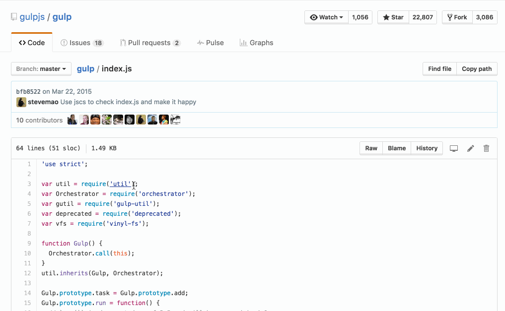

# GitHub Module Highlighter

Highlights JavaScript modules _in CommonJS or ES6 imports_ on GitHub.

[**Get the Chrome extension**](https://chrome.google.com/webstore/detail/github-module-highlighter/pmfpkkicfnpgmkkimjifdofcdomclhkf)

It can take _very_ long to quickly scan JS code on GitHub,
but with this extension some of those problems go away.

* Mouse over to get information from NPM.
* Click to go directly to the source code.

License MIT